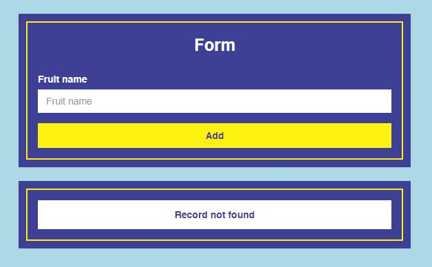
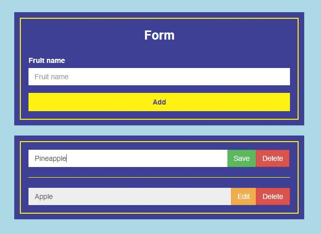

### Tutorial 101: Client Server Scoping with API request

Hi! welcome to Tutorial 101..
in this tutorial we will learn about how to scoping / separating within client and server, then we will make simple API request from client to server.

We will use previous repositories as starter pack in this tutorial:

1. **Server side** : [Tutorial 101: Testing RESTful CRUD with Mocha Chai](https://github.com/digachandra/tutor101-restful-mocha-chai "Tutorial 101: Testing RESTful CRUD with Mocha Chai").
2. **Client side** : [Tutorial 101: Basic HTML CSS with Express JS & EJS Chai](https://github.com/digachandra/tutor101-basic-html-css-express-ejs "Tutorial 101: Basic HTML CSS with Express JS & EJS"), but we will setup without express, just HTML, CSS, JS.

#### Masterpiece that we will make

Default interface, **if no record found**



Filled interface & Editable textbox, **if record exists**



#### 1. Build skeleton

```
├── client
│   ├── asset
│   │   ├── css
|   |   |   └── style.css
│   │   ├── image
|   |   |   └── favicon.png
│   │   └── js
|   |       └── core.js
|   └── index.html
└── server
    ├── config
    │   └── database.js
    ├── controllers
    │   └── fruits.js
    ├── models
    │   └── fruits.js
    ├── routes
    │   └── api.js
    ├── .gitignore
    └── index.js
```

#### 2. Init server side

Remember we need to install required modules first for the **server / api** side

```
cd server
npm install
```

#### 3. Run MongoDB

#### 4. Start server

We will use [Nodemon](http://nodemon.io/ "Nodemon website") to run server

```
nodemon index.js -w
```

#### 5. Init client side

Change directory to **client**

```
cd ../client
```

Refactoring until HTML, CSS & JS only

```
└── client
    ├── asset
    │   ├── css
    |   |   └── style.css
    │   ├── image
    |   |   └── favicon.png
    │   └── js
    |       └── core.js
    └── index.html
```

#### 6. Init index.html (client/index.html)

Initialize skeleton

```
<!DOCTYPE html>
<html lang="en">
  <head>
    <!-- Header goes here -->
  </head>
  <body>
    <!-- Body goes here -->
    <!-- Script goes here -->
  </body>
</html>
```

Initialize header

```
<meta charset="UTF-8">
<meta name="viewport" content="width=device-width, initial-scale=1.0">
<meta http-equiv="X-UA-Compatible" content="ie=edge">
<title>Tutorial 101: Client Server Scoping with API request</title>
<link rel="shortcut icon" href="asset/image/favicon.png" />
<link rel="stylesheet" href="https://maxcdn.bootstrapcdn.com/bootstrap/3.3.7/css/bootstrap.min.css" integrity="sha384-BVYiiSIFeK1dGmJRAkycuHAHRg32OmUcww7on3RYdg4Va+PmSTsz/K68vbdEjh4u" crossorigin="anonymous">
<link rel="stylesheet" href="asset/css/style.css">
```

Initialize body

```
<div id="content" class="container">
  <div class="row">
    <div class="col-sm-6 col-sm-offset-3">
      <div class="panel">
        <div class="panel-wrapper">
          <div class="panel-heading text-center">
            <h3>Form</h3>
          </div>
          <div class="panel-body">
            <form id="content-form">
              <div class="form-group">
                <label for="txt-name">Fruit name</label>
                <input id="txt-name" type="text" class="form-control" autocomplete="off" placeholder="Fruit name" />
              </div>
              <input type="submit" class="btn btn-theme btn-block" value="Add" />
            </form>
          </div>
        </div>
      </div>
      <div class="panel">
        <div class="panel-wrapper">
          <div class="panel-body">
            <ul id="content-list" class="hidden">
              <li>
                <div class="alert alert-theme" role="alert">Kosong</div>
              </li>
              <li>
                <div class="row">
                  <div class="col-sm-12">
                    <div class="input-group">
                      <input type="text" class="form-control" disabled="disabled">
                      <span class="input-group-btn">
                        <button class="btn btn-warning" type="button">Edit</button>
                        <button class="btn btn-danger" type="button">Delete</button>
                      </span>
                    </div>
                  </div>
                </div>
              </li>
            </ul>
          </div>
        </div>
      </div>
    </div>
  </div>
</div>
```

Initialize script

```
<script src="http://code.jquery.com/jquery-3.1.1.min.js"></script>
<script src="https://maxcdn.bootstrapcdn.com/bootstrap/3.3.7/js/bootstrap.min.js" integrity="sha384-Tc5IQib027qvyjSMfHjOMaLkfuWVxZxUPnCJA7l2mCWNIpG9mGCD8wGNIcPD7Txa" crossorigin="anonymous"></script>
<script src="https://cdn.jsdelivr.net/lodash/4.16.2/lodash.min.js"></script>
<script src="asset/js/core.js"></script>
```

#### 7. Init style (asset/css/style.css)

Initialize style

```
html{
  background: #add8e6; // light blue
}
body{
  background: transparent;
}
#content{
  padding: 100px 0px;
}
.panel{
  background: #3E4095;
  border-radius: 0px;
  padding: 10px;
}
.panel .panel-wrapper{
  border: 2px solid #FFF212;
}
.panel .panel-heading{
  padding-top: 20px;
}
.panel .panel-heading *{
  font-weight: bold;
  margin: 0px;
}
.panel label, .panel h1, .panel h2, .panel h3, .panel h4, .panel h5, .panel h6, .panel span, .panel p, .panel{
  color: #FFF;
}
.form-control{
  border: 0px;
  border-radius: 0px;
  box-shadow: none !important;
  outline: none !important;
}
.btn{
  border-radius: 0px;
  outline: none !important;
}
.btn.btn-theme{
  background: #FFF212;
  border: 2px solid #FFF212;
  color: #3E4095;
  font-weight: bold;
}
.btn.btn-theme:hover, .btn.btn-theme:focus{
  background: transparent;
  color: #FFF212;
}
.alert{
  margin: 0px;
}
.alert.alert-theme{
  background: #FFF;
  border-radius: 0px;
  color: #3E4095;
  font-weight: bold;
  padding: 10px 15px;
  text-align: center;
}
ul#content-list{
  list-style: none;
  margin: 0px;
  padding: 0px;
}
ul#content-list li:nth-child(n+2){
  border-top: 1px solid #FFF212;
  margin-top: 20px;
  padding-top: 20px;
}
```

#### 8. Init script (asset/js/core.js)

Initialize skeleton

```
var urlMaster = 'http://localhost:9000/fruits' // API URL

// Module create / insert record starts here

// Module get list of record starts here

// Module update record starts here

// Module delete record starts here

$(function(){
  // trigger module list starts here
  // init module insert starts here
}
```

Initialize module create / insert record

```
function initInsert(){
  var form = $('#content-form')
  var name = $('#txt-name')

  form.unbind().on('submit', function(event){
    event.preventDefault()
    var valueName = name.val().trim()
    if(!_.isEmpty(valueName)){
      name.attr('disabled', 'disabled')
      $.post({
        url: urlMaster,
        data: {
          'name': valueName
        },
        success: function(result){
          if(!_.isEmpty(result)){
            initList()
            name.removeAttr('disabled').val('')
          }
        }
      })
    }
  })
}
```

Initialize module get list of record

```
function initList(){
  var list = $('#content-list')
  list.removeClass('hidden')
  $.get({
    url: urlMaster,
    success: function(result){
      list.empty()
      if(_.isEmpty(result)){
        var html = '<li><div class="alert alert-theme" role="alert">Record not found</div></li>'
        list.append(html)
      } else {
        for(var idx = 0; idx < result.length; idx++){
          var html = `<li><div class="row"><div class="col-sm-12"><div class="input-group"><input type="text" class="form-control" disabled="disabled" value="${result[idx].name}"><span class="input-group-btn"><button class="btn btn-warning" type="button" onClick="initUpdate(this, '${result[idx]._id}')">Edit</button><button class="btn btn-danger" type="button" onClick="initDelete('${result[idx]._id}')">Delete</button></span></div></div></div></li>`
          list.prepend(html)
        }
      }
    }
  })
}
```

Initialize module update record

```
function initUpdate(pointer, id){
  pointer = $(pointer)
  var list = pointer.closest('li').find('input[type="text"]')

  if(list.hasClass('edit')){
    list.attr('disabled', 'disabled').removeClass('edit')
    pointer.removeClass('btn-success').addClass('btn-warning').text('Edit')
    var valueName = list.val().trim()
    if(!_.isEmpty(valueName)){
      $.ajax({
        url: `${urlMaster}/${id}`,
        data: {
          'name': valueName
        },
        method: 'PUT',
        success: function(result){
          if(!_.isEmpty(result)){
            initList()
          }
        }
      })
    }
  } else {
    var tempValue = list.val()
    list.removeAttr('disabled').addClass('edit').focus().val(tempValue)
    pointer.removeClass('btn-warning').addClass('btn-success').text('Save')
  }
}
```

Initialize module delete record

```
function initDelete(id){
  $.ajax({
    url: `${urlMaster}/${id}`,
    method: 'DELETE',
    success: function(result){
      if(!_.isEmpty(result)) initList()
    }
  })
}
```

#### 9. Happy testing!
